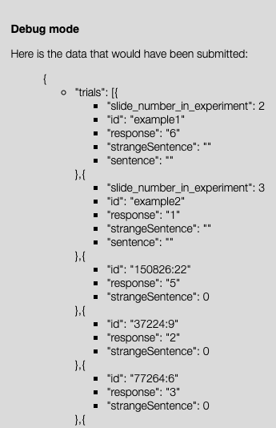

# Updating an Experiment Template
{:.no_toc}

INTRO, EXPLAINING GENERAL SETUP

## Table of contents
{: .no_toc .text-delta }

1. TOC
{:toc}

## Overview

This tutorial assumes that you cloned your repository based on the template at `https://github.com/sebschu/my-project`. 

In the tutorial we will:

* change the instructions
* add stimuli to the experiment 
* randomize stimulus order
* change which information is logged  

Additional things you can do if there is time: 

* implement a between-subjects condition where one group sees the target sentence in context and the other group sees it without context


**IMPORTANT:** Reload the experiment everytime you make a change and always have the developer console (⌘⌥J) open for debugging purposes.  

The three files you will modify in this tutorial are in `experiments/01_implicature_strength`:

* `experiment.html`: contains the code that provides the basic structure of the experiment
* `js/experiment.js`: contains the code that controls the logic of the experiment and handles data logging
* `js/stimuli.js`: contains the items to display

## Change the instructions

When you went through the experiment in your browser, you may have noticed typos in the instructions. Let's fix those!

You'll find the instructions in `experiment.html` -- go ahead and open that file in your favorite editor (e.g., Sublime Text). 

The first part of the file, in between the `<head>...</head>` tags loads javascript files that help control the flow of the experiment, like automatically advancing to the next trial and rotating through stimulus lists. Note that the last two scripts that are loaded are the `experiment.js` and `stimuli.js` scripts that you'll modify later.

Each type of "slide" -- instructions, practice trials, more instructions, main trials, demographic questionnaire, and thank-you page -- is defined in this file with its basic elements within a `<div>` element. Each slide has its own name, saved under the `id` feature. E.g., the instructions slide is called "i0".

You'll find the instructions towards the top of the file. Go ahead and fix the typos, save the files, and reopen the html file in your browser. Have the changes registered?

## Add more stimuli

So far, the experiment only has one target trial. Ideally, we'd like participants to rate a whole set of items, not just one. Let's change that. Go ahead and open `js/experiment.js` in the editor. You'll see that for each of the slide types defined in the html file, there is a corresponding slide() in this file. Each such slide() has features and functions associated with it that control what it does. Here is a list of such features and functions:

* `name`: obligatory feature that should mirror the name in the html file.
* `start`: occurs on slides that don't rotate through stimulus lists. The sequence of commands in the scope of `start` specifies what should initially happen on this slide. 
* `button`: function linked to buttons in the html file and specifies what should happen if the relevant button is clicked.
* `log_responses`: function that specifies how to log data.
* `present`: name of stimulus list to rotate through automatically.
* `present_handle`: on slides that rotate through stimulus lists, replaces `start` to specify what should happen on the slide. Takes an argument (`stim` in our example experiment) that will be treated as the current stimulus.


Scroll down to 

```
slides.trial = slide({
  name: "trial",
```
    
This is where the definition of the target trial begins. You can see that the displayed stimulus is defined in `start`:
  
```
start: function() {
  var stim = {
        "TGrep": "37224:9",
        "Context": "Speaker A:  and, and i, you know, i still provide most of the things that  go on around the house.<p>Speaker B: right.<p>Speaker A: so, uh, yeah and for a while i was going to school too, and tha-, it was tough.<p>Speaker B: yeah,  i uh, i think that while it 's a good change for i think women to be able  to fulfill their potential in whatever they feel, you know, their expertise may be .<p>Speaker A: uh-huh.<p>Speaker B: uh-huh.<p>Speaker A: uh, i think sometimes other things suffer and tha-, i think it 's hard to find a balance there.<p>Speaker B: ",
        "EntireSentence": "but in some ways i think we are expected  to do it all.",
        "ButNotAllSentence": "but in <strong>some, but not all</strong> ways i think we are expected  to do it all."
} 
```
In order to not just display this single stimulus, we need to pass the slide a stimulus list. Precisely such a list is stored in `js/stimuli.js`. Open that file and have a look at its contents. The list `all_stims` contains a list of 20 objects that all have the same structure as the individual `stim` defined above. Perfect! Let's pass this list to our main trial slide type to rotate through. Go back to the `experiment.js` file, comment out the above code block, and uncomment these two lines, which tell the slide to load the list `exp.stimuli` to rotate through, and to call each of the individual elements `stim`:

```
present: exp.stimuli,
present_handle : function(stim) {
```
But wait, where does `exp.stimuli` come from? Whenever you want to trace back the origins of a particular element, search for it. You should find it towards the bottom of the file inside a function called `init()`:

```
function init() {

  exp.trials = [];
  exp.catch_trials = [];
  var stimuli = all_stims;

  exp.stimuli = stimuli;
```
You can see that `exp.stimuli` is assigned `stimuli`, which is in turn defined (one line above it) as `all_stims` -- which is precisely the list of items contained in `stimuli.js`!

Now that the mystery is solved, go ahead and save the file and reopen the html in your browser. If the changes have registered, the experiment should now rotate through all the items in the list automatically. 

**Pro tip 1:** If you want to rapidly jump through different phases of the experiment, type `exp.go()` in the developer console. You can access the console by pressing `⌘⌥J`.

**Pro tip 2:** It often helps to print out the value of a variable if you're not sure it's getting correctly assigned. For example, you might want to print out the contents of `exp.stimuli`, which you can do as follows:

```
console.log(exp.stimuli);
```

## Randomize stimulus order

We often don't want each participant to complete the list of items in the same order, since a particular order might introduce a response bias, which will then be reflected in the data as a whole. A remedy for this is to randomize item order. You can do this very easily by applying the `_.shuffle()` function to the list of items. The most straightforward place to do this is where you first define `exp.stimuli`:

```
exp.stimuli = _.shuffle(stimuli);
```

Done! Check whether it worked by running through the first few items of the experiment.

## Change which information is logged  

If you run through the entire experiment, after the last page you'll see the information that will be submitted to the crowdsourcing platform. Run through a few trials of the experiment and then type `exp.go()` to jump to the end of the experiment, then click through the remaining buttons to see which information would have been submitted. You should see something like the following:




What information is missing? Currently, only the item's unique corpus (tgrep) ID, the Likert scale response, and whther or not the participant considers the blue sentence to be a strange-sounding sentence are recorded. Let's make sure that trial number and the actual sentence that was displayed are also recorded. Within `slides.trial`, search for `log_responses`, the function that specifies which information is recorded. All this function does is add trial-level information as an object to the experiment-wide list `exp.data_trials`. 

```
log_responses: function() {
  exp.data_trials.push({
    "id": this.stim.TGrep,
    // "sentence": this.stim.ButNotAllSentence,
    // "slide_number_in_experiment": exp.phase,
    "response": this.radio,
    "strangeSentence": this.strange
  });
```

Go ahead and uncomment the commented-out lines to record the additional information and test whether your changes registered. 


## Bonus: Implement a between-subjects condition

You'll have noticed that the definition of each stimulus also contains information about the context that the target sentence occurred in. We might be interested in assessing whether the inclusion of context affects participants' inference ratings by displaying context for one group of participants and omitting it for another group. How do we implement this?

Fist, include a placeholder for the context in `experiment.html` by uncommenting the following line:
```
<p class="case" style="text-align: left;"></p>
```

Now that the placeholder exists, fill it out in `experiment.js`. You need to make three modifications: assign participants randomly to a "context" or "no-context" condition, specify the display/omission of context on the trial slide, and log the condition. One by one:

Assign a condition to each participant at the beginning of the experiment, i.e., at the *end* of `experiment.js`, in `init() {...}`, by uncommenting the following line:

```
exp.condition = _.sample(["context", "no-context"]);
```

Next, make sure that context is displayed/omitted contingent on the condition variable. Uncomment the following chunk of code in `slides.trial`:

```
if (exp.condition == "context") {
  // extract context data
  var contexthtml = stim.Context;
  // reformat the speaker information for context
  contexthtml = contexthtml.replace(/Speaker A:/g, "<b>Speaker #1:</b>");
  contexthtml = contexthtml.replace(/Speaker B:/g, "<b>Speaker #2:</b>");
  $(".case").html(contexthtml);
} else {
  var contexthtml = "";
  $(".case").html(contexthtml);
}
```

Finally, log the condition by adding the following information to `log_responses` in `slides.trial`:
```
"condition": exp.condition,
```

Done! Test extensively -- both that context is correctly displayed/omitted and that the condition information is indeed being recorded.

